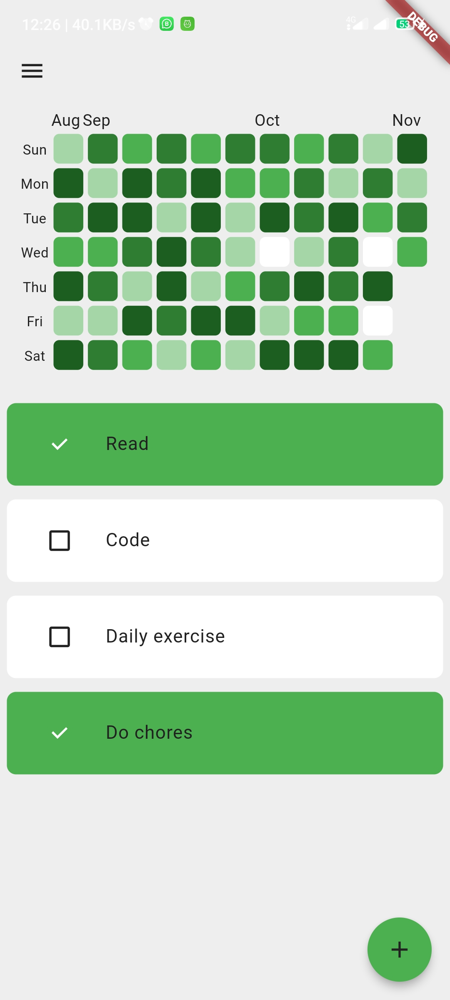
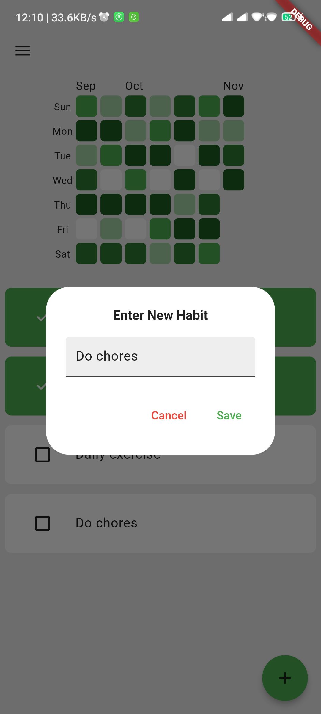
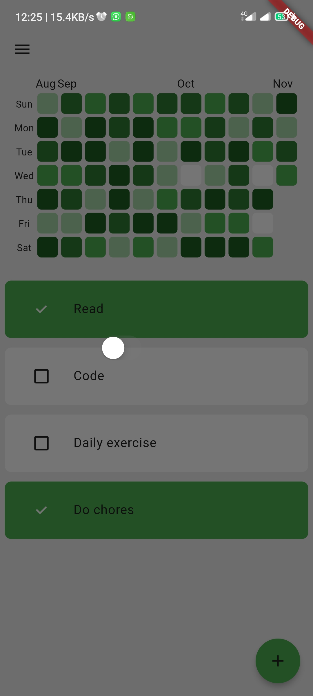
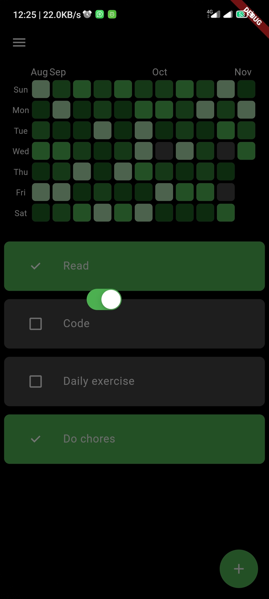

# 🧠 Habit Tracker (Flutter)

---

## 🚀 Overview

Habit Tracker helps users build consistency by tracking daily habits and visualizing progress using a heatmap similar to GitHub contributions.

---

## ✨ Features

* ✅ Create, update, and track daily habits
* 📅 GitHub-style heatmap visualization
* 📊 Intensity-based progress (0–4 levels)
* 💾 Offline-first using Isar database
* ⚡ Reactive UI (instant updates without manual refresh)

---

## 📸 Screenshots

<p align="center">
  
  
  
  
</p>

---

## 🏗️ Architecture

This project follows **Clean Architecture**:

```
Presentation → Domain → Data
```

### 🔁 Data Flow

```
UI → HabitProvider → ToggleHabitUseCase
   → HabitRepo + HeatmapRepo → Isar DB
   → Providers react → UI updates automatically
```

---

## 🧩 Architecture Diagram

<p align="center">
  
</p>

```text
        ┌────────────┐
        │    UI      │
        │ (Flutter)  │
        └─────┬──────┘
              │
              ▼
      ┌────────────────┐
      │ HabitProvider  │
      └─────┬──────────┘
            │
            ▼
  ┌──────────────────────┐
  │ ToggleHabitUseCase   │
  └─────┬────────┬───────┘
        │        │
        ▼        ▼
 ┌───────────┐ ┌──────────────┐
 │ HabitRepo │ │ HeatmapRepo  │
 └─────┬─────┘ └─────┬────────┘
       │             │
       ▼             ▼
     ┌───────────────────┐
     │     Isar DB       │
     └───────────────────┘
       ▲             ▲
       │             │
 ┌──────────────┐ ┌───────────────┐
 │HabitProvider │ │HeatmapProvider│
 │ loadHabits() │ │loadHeatmap()  │
 └─────┬────────┘ └─────┬─────────┘
       │                │
       ▼                ▼
     ┌─────────────────────────┐
     │   UI updates (reactive) │
     └─────────────────────────┘
```

---

## 📊 Heatmap Logic

* Data structure: `Map<DateTime, int>`
* Each day stores:

  * total habits
  * completed habits
  * intensity level (0–4)

```
intensity = (completed / total) → mapped to 0–4
```

This ensures accurate visualization based on daily performance.

---

## ⚙️ Tech Stack

* Flutter
* Provider (State Management)
* Isar (Local Database)

---

## 📁 Project Structure

```
lib/
├── data/          # Models & repository implementations
├── domain/        # Entities, contracts, usecases
├── presentation/  # UI & providers
└── main.dart
```

---

## 🌟 Key Highlights

* Clean Architecture (production-ready structure)
* Event-driven updates (no UI hacks)
* Decoupled state management
* Efficient local-first data handling

---

## 📌 Future Improvements

* Cloud sync (Firebase / Supabase)
* Push notifications & reminders
* Advanced analytics dashboard

---

## 👤 Author

**Arinze Ihim**
Flutter Developer 🚀
