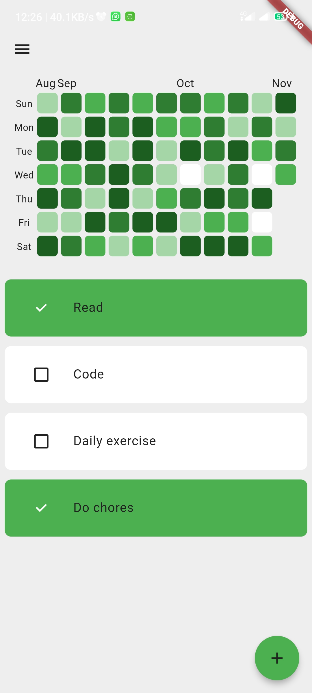
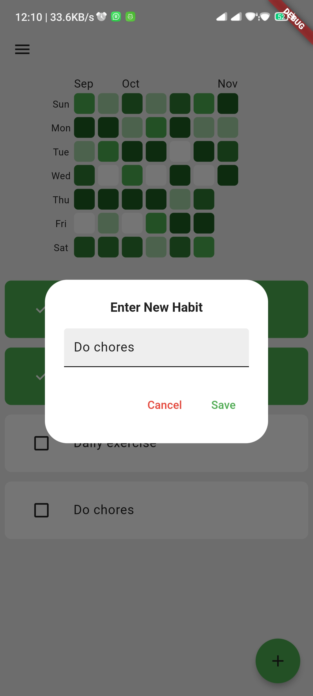
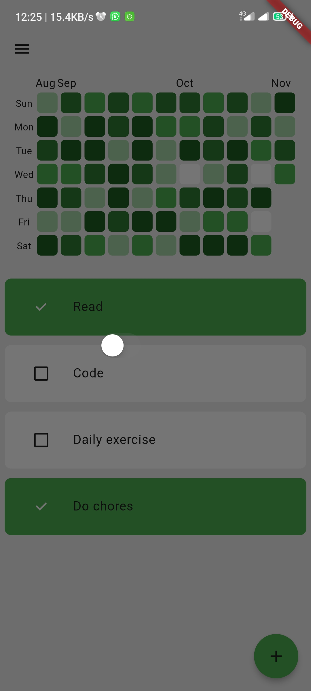
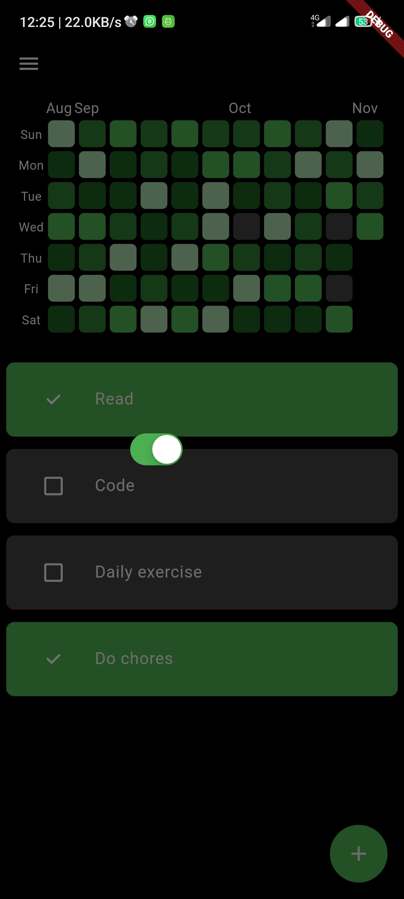

# Habit Tracker

An easy-to-use Habit Tracker application built with Flutter.
This app helps users track and manage their habits effectively to improve productivity and achieve goals.

## Features

- **Habit Management**: Add, edit, and delete habits effortlessly.
- **Progress Tracking**: Visualize your habit progress over time.


## Screenshots

<p align="center">
  
  
  
  
</p>


<p align="center">
  
  
</p>

## Getting Started

A few resources to get you started if this is your first Flutter project:

- [Lab: Write your first Flutter app](https://docs.flutter.dev/get-started/codelab)
- [Cookbook: Useful Flutter samples](https://docs.flutter.dev/cookbook)

For help getting started with Flutter development, view the
[online documentation](https://docs.flutter.dev/), which offers tutorials,
samples, guidance on mobile development, and a full API reference.

### Prerequisites

- Flutter SDK: [Install Flutter](https://flutter.dev/docs/get-started/install)
- A code editor (e.g., VS Code, Android Studio)

### Installation

1. **Clone the repository:**
    ```bash
    git clone https://github.com/yourusername/habit-tracker.git
    cd habit-tracker
    ```

2. **Install dependencies:**
    ```bash
    flutter pub get
    ```

3. **Run the app:**
    ```bash
    flutter run
    ```

## Project Structure

The project is organized as follows:

## Project Structure

The project is organized as follows:

```plaintext
lib/
├── components/   # Reusable components
├── data/         # Data sources and handling
├── models/       # Data models and structures
├── screens/      # UI screens
├── themes/       # App themes and styling
└── main.dart     # Entry point of the app
